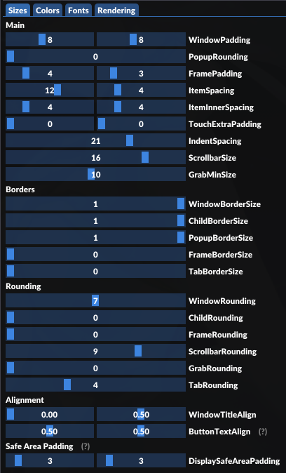
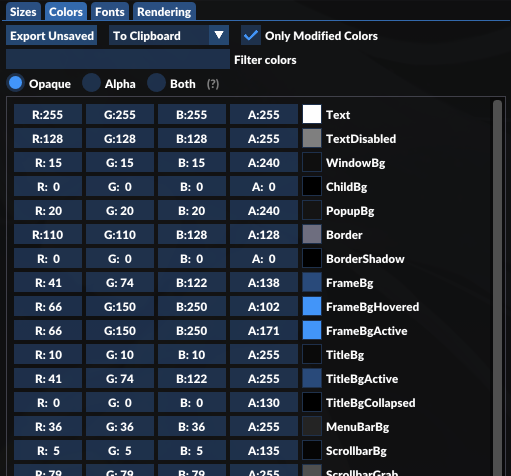

# Getting started with making a Quaver Editor plugin

## Table of Contents

- [Getting started with making a Quaver Editor plugin](#getting-started-with-making-a-quaver-editor-plugin)
    - [Table of Contents](#table-of-contents)
    - [Setup](#setup)
        - [Files](#files)
        - [Editing](#editing)
    - [Important concepts](#important-concepts)
        - [C++ to C# to Lua?](#c-to-c-to-lua)
        - [Semicolons](#semicolons)
        - [if and for](#if-and-for)
        - [Scope](#scope)
        - [Constants](#constants)
        - [Arrays/Lists/Tables](#arraysliststables)
        - [Pass by value/reference](#pass-by-valuereference)
        - [Immediate Mode GUI (IMGUI)](#immediate-mode-gui-imgui)
        - [State variables](#state-variables)
        - [A few things you can't do with plugins](#a-few-things-you-cant-do-with-plugins)
        - [Debugging](#debugging)
        - [Useful links](#useful-links)
    - [Making a plugin](#making-a-plugin)
        - [Windows](#windows)
        - [Draw text](#draw-text)
        - [Integer input box](#integer-input-box)
        - [Any input element](#any-input-element)
        - [Buttons](#buttons)
        - [Plots](#plots)
            - [Pushing and popping](#pushing-and-popping)
        - [More UI elements](#more-ui-elements)
        - [Keypresses](#keypresses)
        - [Drawing](#drawing)
        - [Styling](#styling)
            - [Plugin Sizes](#plugin-sizes)
            - [Plugin Colors](#plugin-colors)
    - [Interact with the editor and maps](#interact-with-the-editor-and-maps)
        - [Place a single object](#place-a-single-object)
        - [Place a batch of objects](#place-a-batch-of-objects)
    - [Advanced concepts](#advanced-concepts)
        - [State variable management](#state-variable-management)
        - [Module management](#module-management)
        - [Using an actual multi-file structure](#using-an-actual-multi-file-structure)
    - [Noteworthy findings](#noteworthy-findings)
        - [Instant plugin update](#instant-plugin-update)
        - [Slider/Drag Int/Float 4 types](#sliderdrag-intfloat-4-types)
        - [Vector2/3/4 Datatypes](#vector234-datatypes)
    - [Available resources](#available-resources)
        - [Quaver Enums](#quaver-enums)
            - [GameMode](#gamemode)
            - [Hitsounds](#hitsounds)
            - [TimeSignature](#timesignature)
        - [ImGui Enums](#imgui-enums)
        - [Quaver Structures](#quaver-structures)
            - [HitObjectInfo](#hitobjectinfo)
            - [SliderVelocityInfo](#slidervelocityinfo)
            - [TimingPointInfo](#timingpointinfo)
        - [State](#state)
        - [Map](#map)
        - [Editor Actions](#editor-actions)
        - [Utilities](#utilities)

## Setup

It is assumed that you are familiar with Lua syntax and basic programming knowledge.

### Files

1. Create a folder in `Quaver/Plugins/yourFolderName`

    - Will be under `Quaver/bin/Debug/netcoreapp2.1/Plugins/` if building yourself

2. Create following files inside the folder

    - settings.ini

        ```ini
        [Settings]
        Name = Plugin Name
        Author = Your Name
        Description = Your description
        ```

    - plugin.lua

        ```lua
        function draw()
            imgui.Begin("Window Title")
            imgui.End()
        end
        ```

### Editing

Open up the Quaver Editor. The plugin should show up under the Plugins menu, as
long as you did everything correctly. Whenever you edit code and save the
`plugin.lua` file, the plugin in-game will update automatically.

Use any editor you like, preferably one that has syntax highlighting for Lua.

## Important concepts

### C++ to C# to Lua?

[ImGui][ImGui], the base of the plugin system, was originally written in C++.
Since Quaver is written in C#, a C# implementation for ImGui called
[ImGui.NET][ImGui.NET] is used. And finally, to make things easier to write, the
script language Lua in a sandbox environment with the [MoonSharp][MoonSharp]
interpreter is used. All ImGui or Quaver related functions and structures that
work in Lua have already been implemented in C#, which is why the existing
Quaver C# code is basically the documentation. All functions that derive from
ImGui can be accessed with `imgui.function()` and can be found in
[ImGuiWrapper.cs][Quaver/ImGuiWrapper.cs], ImGui enums, their implementations
and the Quaver functions and structures are spread over many files, which is why
I have compiled them in this guide at the end in the
[Available Resources](#available-resources) section, along with the C# snippets.

### Semicolons

Semicolons are optional in lua. You can decide to use them, or you can decide to
leave them out. I will leave them out for all code examples. You can put
multiple statements into a single line if you use semicolons so separate them.

### if and for

When coming from a different programming language, it's very easy to forget the
"`then`" keyword at the end of the if-condition. The correct form of the
if-statement is

```lua
if condition then
    -- do something
end
```

Same thing with the standard for-loop, which has "`do`" at the end.

```lua
for i=0, 10, 1 do
    -- do something
end
```

You can also use parantheses if you feel more comfortable with it!

```lua
for (i=0, 10, 1) do
    if (i % 2 == 0) then
        -- do something
    end
end
```

### Scope

If you've programmed with different languages, then you'll have heard of this
term before. It describes the persistance of a variable after the end of the
containing function or structure.

Lua's variables are global by default when you declare them as is. They are
accessible from any function calling the containing scope. So following code
would work.

```lua
function draw()
    imgui.Begin("Example")
    f()
    imgui.Text(text)
    imgui.End()
end

function f()
    text = "Hello!"
end
```

Local variables are scope limited to the block they were defined in and are
declared like `local a = 10`. They are prioritized over global variables, if
declared with the same name (shadowing). My main recommendation would be to
always use local variables, unless you know what you're doing.

You can explicitly define a block with `do ... end`.

Another thing to note is that you can define global variables to use, but only
if you don't assign any script related variable to them (includes anything that
isn't available in vanilla Lua by default), since the script variables are only
initialized in the `draw()` function.

```lua
thisGlobalVarWorks = 5
thisGlobalVarDoesntWork = #map.HitObjects -- number of hitobjects

function example()
    print(thisGlobalVarWorks) -- works
    print(thisGlobalVarDoesntWork) -- doesn't work
end
```

### Constants

Constants aren't a thing in Lua and the workaround is more effort for what it's
worth, so I recommend just sticking to UPPER_SNAKE_CASE naming for your
variables, since that's the most common way to write variable names for
constants.

### Arrays/Lists/Tables

There aren't any arrays/lists in Lua, only tables. A table is essentially a
dictionary, and it can be used like a normal array by assigning a number as the
key for the dictionary. It does this by default. You initialize a table with
`myTable = {}`. Add more elements to the table with
`table.insert(myTable, myVariable)`. Access table elements with `myTable[key]`,
where key can be of any type. You can also access them with `myTable.key`.

Important: Take note that everything in Lua is indexed from 1, not 0!

Related: [Lua-users.org Tables Tutorial](http://lua-users.org/wiki/TablesTutorial)

### Pass by value/reference

When calling a function, it's important to know how a language handles its
parameters. Is it pass by value? Is it pass by reference? In Lua it's a mix of
both, it depends on the type passed. This is how each type behaves:

| Type       | Pass by... |
| ---------- | ---------- |
| `nil`      | value      |
| `boolean`  | value      |
| `number`   | value      |
| `string`   | value      |
| `function` | reference  |
| `userdata` | reference  |
| `thread`   | reference  |
| `table`    | reference  |

### Immediate Mode GUI (IMGUI)

It's important that you get comfortable with the "immediate mode GUI" concept.
If you've programmed GUIs in other programmin languages before, you may remember
that you added everything to something via functions to a general frame, and
then at the end start/render/unhide the construct. That's called Retained Mode
GUI (RMGUI). This is not exactly the case with IMGUI.

A RMGUI creates the GUI once and changes the affected elements depending on the
user actions. It saves the state between each frame and knows which elements it
doesn't have to rerender. An IMGUI "creates" the GUI every frame and doesn't
save the state (refer to the next section). Everything is redrawn every frame.
(This part is very simplified.)

The advantage that IMGUI has over RMGUI is that all of the rendering, the
callbacks, the data transfers and everything, is managed by the library. While
in RMGUI you might have to first create a button, create a callback, assign that
callback to the button, add the button to the frame and then render the frame,
in IMGUI you can simply create a button and then check the value of that button
with, for example, an if statement to evaluate.

You don't have to worry about any adding. Any frame management. No callbacks.
And that's the system we are using with [Dear ImGui][ImGui].

Refer to: [Retained Mode Versus Immediate Mode](https://docs.microsoft.com/en-us/windows/win32/learnwin32/retained-mode-versus-immediate-mode)

### State variables

Referring to [IMGUI](#immediate-mode-gui-imgui), the plugin is rerendered every
frame. This also means, that all variables in the plugin are cleared every
frame. The way GUI elements here work, is that they are fed a value to display
and then a value is spit out whenever the user changes that element. But how
does the plugin know which value to initially display? Or where does the plugin
save the value?

We need a way to save the values across frames.

This is done by using the provided `state` object. First you retrieve the value
from the `state` object, you do your calculations and then it's saved to the
state object again. Following function increments the variable `n` by 1 on every
frame.

```lua
function draw()
    -- label is typically the same as the variable name itself, so it would be
    -- "n" in this case. it doesn't really matter, all that matters is that it's
    -- the same as in the final state.SetValue() function
    local n = state.GetValue("choose your own identifier!")

    if n == nil then
        n = 0 -- default value when variable is initialized for the first time
    end

    n = n + 1; -- yes, there is no += or -= in lua

    state.SetValue("choose your own identifier!", n)
end
```

### A few things you can't do with plugins

- Use a multi-file/module structure for your code
    - Everything has to be inside `plugin.lua`
    - Refer to section [Module Management](#module-management) and
      [Using an actual multi-file structure](#using-an-actual-multi-file-structure)
      if you're ready to go the extra mile
- Import external resources
- Connect to the internet/an external API
- Work with the local file system (create, read, write)

### Debugging

I'll be honest: the error messages the console returns on bad code are nearly
useless. You'll have to do some manual debugging and comment out code piece by
piece until you hit the part that hurts. If you're building Quaver yourself and
have the console available, it's possible to print to the console using
`print()` in Lua. Or you can write the content of a variable into a
`imgui.TextWrapped()` in the plugin. It's up to you.

If you're testing an algorithm, I don't recommend testing that algorithm in an
actual plugin. Do it in an actual Lua interpreter. Go on a website if you will.

I made a
[plugin](https://gist.github.com/IceDynamix/2269f6f486752413eb987b741454d029)
that displays all state/map variables for debugging purposes.

Lastly, it's important to mention that `pcall()` (protected call, essentially a
try-block) and `xpcall()` (executes a callback function if the function errors)
do not work right now.

### Useful links

- [Quaver Github](https://github.com/Quaver)
- [ImGui][ImGui]
- [ImGui.NET][ImGui.NET]
- [Quaver/ImGuiWrapper.cs][Quaver/ImGuiWrapper.cs]
- [MoonSharp][MoonSharp]

## Making a plugin

### Windows

Let's take a look at the sample code provided in [Setup/Files](#files).

```lua
function draw() -- Quaver *always* starts out in the draw() function
    imgui.Begin("Window Title")
    imgui.End()
end
```

First of all, Quaver always looks for the `draw()` function and goes on from
there. This is different to what one would expect, where a `main()` function is
the entry point. Looking at the output, we can see that a window with a title
has popped up in the editor. As you can already guess, you can make a window
with the `imgui.Begin()` and the `imgui.End()` functions.

### Draw text

It's recommended to keep each window in its own function, to keep everything
organized.

```lua
function draw()
    window1()
    window2()
end

function window1()
    imgui.Begin("Window Title 1")
    imgui.Text("Example 1")
    imgui.End()
end

function window2()
    imgui.Begin("Window Title 2")
    -- Note: .. signifies concatenation
    local mySuperLongString = "Very long and cool text that wraps around if " ..
        "the window gets smaller and smaller " ..
        "and smaller and smaller and smaller " ..
        "and smaller and smaller and smaller."
    imgui.TextWrapped()
    imgui.End()
end
```

### Integer input box

There's a lot of different elements you can implement, check out the
[ImGuiWrapper.cs][Quaver/ImGuiWrapper.cs] to know what can or what can't be
added.

Let's take this as an example:

```cs
public static bool InputInt(string label, ref int v) => ImGui.InputInt(label, ref v);
```

The only important part is `InputInt(string label, ref int v)`. Looking at the
code, we can see something weird with the function; it uses a `ref` parameter
(which is basically a pointer). Lua doesn't exactly work with ref parameters, so
it needs a different way to express that relation in the code. If you don't care
about the details, then this is what you would need to do to get an integer text
box:

```lua
function draw()
    imgui.Begin("Window Title")

    local myInt = get("myInt", 0)
    uselessVariable, myNextInt = imgui.InputInt("My custom label", myInt)
    state.SetValue("myInt", myNextInt)

    imgui.End()
end

function get(identifier, defaultValue)
    return state.GetValue(identifier) or defaultValue
end
```

If you *do* care about the details of why it's handled in Lua this way, check
out [this](http://www.moonsharp.org/objects.html#byref).

Since the first return value of the `InputInt()` function isn't important to us,
we can use any short variable name to make life easier for us. It's common to
use an underscore for any irrelevant values. We can also write the new value
back into the old variable, so there's no need to create a new one.

```lua
-- The code examples from now on will assume, that you're in a window environment
-- as provided by imgui.Begin() -- imgui.End(), unless specified otherwise

local myInt = get("myInt", 0)
_, myInt = imgui.InputInt("My custom label", myInt)
state.SetValue("myInt", myInt)
```

There are a few overloads for the `InputInt()` function in the
[ImGuiWrapper.cs][Quaver/ImGuiWrapper.cs], let's take a look:

```cs
// ImGuiWrapper.cs

public static bool InputInt(string label, ref int v)
    => ImGui.InputInt(label, ref v);
public static bool InputInt(string label, ref int v, int step)
    => ImGui.InputInt(label, ref v, step);
public static bool InputInt(string label, ref int v, int step, int step_fast)
    => ImGui.InputInt(label, ref v, step, step_fast);
// one more...
```

Let's filter the irrelevant information out though:

```cs
InputInt(string label, ref int v);
InputInt(string label, ref int v, int step);
InputInt(string label, ref int v, int step, int step_fast);
InputInt(string label, ref int v, int step, int step_fast, ImGuiInputTextFlags flags);
```

Feel free to play around with the different parameters! In case you want to use
the input flags in the last function, take a look at
[ImGui Enums](#imgui-enums) and check, which one you need to use. The
documentation for the enums themselves can be found either in the
[ImGui.NET/C#_Enums][ImGui.NET/C#_Enums] or directly in the
[ImGui/C_Enums][ImGui/C_Enums]

### Any input element

You can apply the same principles to any other datatype though. Take a string
for example:

```cs
InputText(string label, ref string input, uint maxLength)
```

The only difference to the `InputInt()` function is the new parameter, which
requires you to provide a maximum length of the input string. The example uses a
limit of 50 characters.

```lua
-- Make sure to skip the `local` keyword when declaring a "constant"
MAXIMUM_INPUT_STRING_LENGTH = 50

function draw()
    imgui.Begin("Window Title")

    local myString = get("myString", "")
    _, myString = imgui.InputText("My custom label", myString, MAXIMUM_INPUT_STRING_LENGTH)
    state.SetValue("myString", myString)

    imgui.End()
end
```

It *would* be best to define a constant for it... if only constants were a thing
in Lua. Refer to [Constants](#constants).

Again, check out the [Quaver/ImGuiWrapper.cs][Quaver/ImGuiWrapper.cs] for all
possible input values. You should be able to figure everything out by now. Try
thinking about how you would go on about making a checkbox or an integer slider!

```cs
/*...*/ Checkbox(string label, ref bool v) /*...*/
/*...*/ SliderInt(string label, ref int v, int v_min, int v_max) /*...*/
```

### Buttons

A button in Lua is as simple as `imgui.Button(label)`. Checking the state of the
button (pressed/not pressed) is done by checking the value (a boolean) of the
button itself. This example prints out "Hello World!" to the console when you
press the button.

```lua
local myButton = imgui.Button("Hello?")

if myButton then
    print("Hello World!")
end
```

Or in short:

```lua
if imgui.Button("Hello?") then
    print("Hello World!")
end
```

### Plots

There's something off about the original [ImGui.NET][ImGui.NET] wrapper function
for plots. Can you find it?

```cs
void PlotLines(string label, ref float values, int values_count)
```

Right. Why is `values` a float reference when it should actually be a float[]
reference? Refer to
[issue #105](https://github.com/mellinoe/ImGui.NET/issues/105) on the ImGui.NET
repository. But now is the question... How do you actually make a plot in Lua
now? Lua doesn't really do references.

That's where I took matters into my own hands. I rewrote the
[Quaver ImGuiWrapper][Quaver/ImGuiWrapper.cs] to make it take an array. This is
how it is currently implemented, after merging
[my pull request](https://github.com/Quaver/Quaver/pull/1985):

```cs
void PlotLines(string label, ref float[] values, int values_count)
    => ImGui.PlotLines(label, ref values[0], values_count)
```

Now you can pass the entire table like this!

```lua
local values = { 1.0, -1.0, 3.0, 6.6 }
PlotLines("My Plot!", values, #values)
```

#### Pushing and popping

Since Quaver plugins rely on [immediate mode GUI](#immediate-mode-gui-imgui),
there are methods for "toggling" certain states on and off. Take this for
example:

```lua
imgui.Columns(2) -- Everything from here on is split into two columns
imgui.Text("I'm in column 1")
imgui.NextColumn()
imgui.Text("I'm in column 2")
imgui.NextColumn()
imgui.Columns(1) -- Back to one column!
```

Or this:

```lua
if imgui.TreeNode("My foldable section") then -- starts the tree section
    imgui.Text("You can see me") -- Only visible if the tree node is active
    imgui.TreePop() -- ends the tree section
--  ^^^^^^^^^^^^^^^ If this weren't here, everything after this might also be
--                  affected by a tree section.
end
```

This kind of principle works with various other elements. Take for example:

| Push Function            | Pop Function            |
| ------------------------ | ----------------------- |
| `imgui.Begin()`          | `imgui.End()`           |
| `imgui.Begin___()`       | `imgui.End___()`        |
| `imgui.Columns(n)`       | `imgui.Columns(1)`      |
| `imgui.Indent()`         | `imgui.Unindent()`      |
| `imgui.PushItemWidth()`  | `imgui.PopItemWidth()`  |
| `imgui.PushStyleVar()`   | `imgui.PopStyleVar()`   |
| `imgui.PushStyleColor()` | `imgui.PopStyleColor()` |

### More UI elements

There are many more GUI elements to be discovered! There's a demo window by
ImGui, showcasing many of the available elements, which can be accessed by
calling the `imgui.ShowDemoWindow()` function in a plugin.

```lua
function draw()
    imgui.ShowDemoWindow()
end
```

Everything seen in the demo window can (probably) be realized in a Quaver plugin
as well. The source code for the demo window can be found at
[ImGui/imgui_demo.cpp][ImGui/imgui_demo.cpp]. Just apply different syntax
(`imgui.Function()` instead of `ImGui::Function()`) and apply
pointers/addresses/ref parameters as seen in
[Creating an integer input box](#creating-an-integer-input-box).

### Keypresses

You can detect keypresses with plugins, which can allow you to make assign all
kinds of custom keybinds to your favorite actions! This is achieved by using
these utility functions:

```cs
// Only returns true on the exact frame the key was pressed/releaseed
bool IsKeyPressed(Keys k);
bool IsKeyReleased(Keys k);
// Always returns true as long as the key is (not) held
bool IsKeyDown(Keys k);
bool IsKeyUp(Keys k);
```

The keys are specified with the
[MonoGame.Framework.Input.Keys enum](https://github.com/Quaver/MonoGame/blob/latest-develop/MonoGame.Framework/Input/Keys.cs),
which can be accessed in the script with `keys.Tab` as an example.

```lua
if utils.IsKeyDown(keys.Space) then
    imgui.Text("Space is pressed!")
else
    imgui.Text("Space is not pressed!")
end
```

For key combinations involving modifier keys to work as traditionally (hold
modifier and press next key), you need to use `utils.IsKeyDown()` for the modifier
and `utils.IsKeyPressed()` for the key. Otherwise you'd have to hit both keys at
the exact same frame. Here is an example to make Ctrl+K/L move the current time
forward/back by 1 second:

```lua
if utils.IsKeyDown(keys.LeftControl) and utils.IsKeyPressed(keys.L) then
    actions.GoToObjects(state.SongTime + 1000)
elseif utils.IsKeyDown(keys.LeftControl) and utils.IsKeyPressed(keys.K) then
    actions.GoToObjects(state.SongTime - 1000)
end
```

Keep in mind that keybinds don't require any interface! You could just as well
put the above code into the draw() without a imgui.Begin()/End() environment and
it would still work as intended.

### Drawing

<!-- TODO -->

### Styling

Following code will bring up the style editor, where you can experiment with all
of the possibilities with changing the looks of your plugin:

```lua
function draw()
    imgui.ShowStyleEditor()
end
```

Anything you change in the style editor will apply to all windows in the plugin.
Feel free to bring up the demo window with `imgui.ShowDemoWindow()` and check
out how everything looks.

There are two importants sections, sizes and colors. You won't be able to change
the font, so don't bother. Now, to apply the styles to your plugin you have to
do following.

#### Plugin Sizes



You can apply new sizes with this:

```lua
imgui.PushStyleVar(imgui_style_var.property, value)
```

If there are multiple values associated with a value, then pass a table with n
elements. If I wanted to change the WindowPadding to be 20, 20 then I would do

```lua
imgui.PushStyleVar(imgui_style_var.WindowPadding, { 20, 20 })
```

#### Plugin Colors



You can change the color with a color picker upon clicking on the colored square
next to the color element. After you're done adjusting, you can export the
colors to your clipboard with the button near the top called "Export Unsaved"
(refer to image). The checkbox is optional, unselecting it will color all
colors, including the default ones. The copied colors will look like this:

```cpp
ImVec4* colors = ImGui::GetStyle().Colors;
colors[ImGuiCol_Text]                   = ImVec4(1.00f, 1.00f, 1.00f, 1.00f);
colors[ImGuiCol_FrameBg]                = ImVec4(0.72f, 0.44f, 0.71f, 0.54f);
colors[ImGuiCol_FrameBgHovered]         = ImVec4(0.55f, 0.20f, 0.51f, 0.40f);
colors[ImGuiCol_TitleBgActive]          = ImVec4(0.16f, 0.19f, 0.23f, 1.00f);
colors[ImGuiCol_Tab]                    = ImVec4(0.63f, 0.67f, 0.72f, 0.86f);
```

Now of course, this is C++ code, and we can't just copy that into our Lua
script. We also can't directly edit the style colors like shown, we have to rely
on pushing/popping colors instead. So each line you get in the style of:

```cpp
colors[ImGuiCol_Element] = ImVec4(0.10f, 0.20f, 0.30f, 0.40f);
```

You need to convert that into:

```lua
imgui.PushStyleColor(imgui_col.Element, {0.10, 0.20, 0.30, 0.40});
```

I made a
[very lazy plugin](https://gist.github.com/IceDynamix/eeb735e6206b5c48c08b9011a192e200),
that converts the C++ code into Lua code, so you don't have to do it yourself.
Make sure to rename the plugin file to plugin.lua and put everything into a
directory in your plugins folder.

## Interact with the editor and maps

Make sure to check out the [available resources](#available-resources) to see
which values you can access! The common workflow for placing any kind of object
is going to be **converting values into an object with an utility function and
then placing/removing them with the according action function**.

Remember:

1. Create Object with `utils.Create___()`
2. Place Object with `action.Place___()`

- [Object](#quaver-structures)
    - [Utility](#utilities) function
    - [Action](#editor-actions) function
    - [ActionBatch](#editor-actions) function

- HitObject
    - `utils.CreateHitObject()`
    - `action.PlaceHitObject(obj)`
    - `action.PlaceHitObjectBatch(table)`

- ScrollVelocity
    - `utils.CreateScrollVelocity()`
    - `action.PlaceScrollVelocity(obj)`
    - `action.PlaceScrollVelocityBatch(table)`

- TimingPoint
    - `utils.CreateTimingPoint()`
    - `action.PlaceTimingPoint(obj)`
    - `action.PlaceTimingPointBatch(table)`

### Place a single object

```lua
-- This is an example for a single hitobject.

-- Place a note at the current editor position in lane 1
-- You would place a long note by specifiying an end time, refer to
-- section Utilities
obj = utils.CreateHitObject(1, state.SongTime)
actions.PlaceHitObject(obj)

-- This is an example for a single SV point.

sv = utils.CreateScrollVelocity(1000, 1.5) -- offset, sv
actions.PlaceScrollVelocity(sv)
```

The same applies to timing points.

### Place a batch of objects

Placing objects in a batch will result in a grouped undo/redo in the editor.
Keep in mind that there aren't any "arrays" in the traditional sense, only
tables (refer to [Arrays/Lists/Tables](#arraysliststables)). The following
example shows how to work with a batch of SVs. The same concepts apply to hit
objects and timing points! You can find an example in my SV plugin:
[`sv_linear()`](https://github.com/IceDynamix/iceSV/blob/master/modules/sv.lua),
[`editor_placeSVs()`](https://github.com/IceDynamix/iceSV/blob/master/modules/editor.lua).

```lua
svObject1 = utils.CreateScrollVelocity(1000, 1.5)
svObject2 = utils.CreateScrollVelocity(2000, 2.0)

-- There aren't any "arrays" or "lists" in lua, only tables
svList = {}
table.insert(svList, svObject1) -- Iterable with a for-loop
table.insert(svList, svObject2)

-- Alternatively use actions.PlaceScrollVelocityBatch({svObject1, svObject2})
actions.PlaceScrollVelocityBatch(svList)
```

## Advanced concepts

### State variable management

There are a few ways to go about this. One would be to use wrapper functions
like this, every time we want to set up a new variable to use.

```lua
function draw()
    state.SetValue("n", get("n", 0) + 1)
end

function get(identifier, defaultValue)
    return state.GetValue(identifier) or defaultValue -- return default if nil
end
```

This gets really really confusing as the number of variables increase. You can't
use the same identifier, or otherwise you're going to run into issues with
retrieving the wrong values. Additionally, you have to use `get()` and
`setValues()` every time you declare a new variable. Say you have 20 persistent
values to keep across states? Gotta use 40 lines just to manage them.

This is why I have set up following system in my personal project:

```lua
function draw()
    imgui.Begin("Window")
    exampleMenu()
    imgui.End()
end

function exampleMenu()
    local menuID = "example"
    local vars = {
        myString = "default",
        myNumber = -1
    }

    retrieveStateVariables(menuID, vars)

    vars.myNumber = vars.myNumber + 1
    -- alternatively: vars["myNumber"] = vars["myNumber"] + 1

    saveStateVariables(menuID, vars)
end

function retrieveStateVariables(menuID, variables)
    for key in pairs(variables) do
        variables[key] = state.GetValue(menuID..key) or variables[key]
    end
end

function saveStateVariables(menuID, variables)
    for key in pairs(variables) do
        state.SetValue(menuID..key, variables[key])
    end
end
```

Every time you want to set up a new scope you want your variables to reside in
(usually separate menus), you need to define a menu ID (to prevent other menus
with identical variable names) and a variables (vars) table. The variables table
is filled with the variables you want to define, along with their default
values.

You call the `retrieveStateVariables()` function once after defining your vars
table. You do your calculations and call the `saveStateVariables()` function
once at the end of your scope. Now you only need to worry about your menu IDs
being different.

If you want to track create a new state variable, all you need to do is create
another element in the vars table. Your intelligent editor with IntelliSense
will also provide autocompletion as soon as you type `vars.`.

### Module management

Remember in
[A few things you can't do with plugins](#a-few-things-you-cant-do-with-plugins),
when I told you you can't use a multifile structure? Next best thing you can do
is simulate module behavior. Let's take the code example from the section above:

```lua
function draw() --[[ code ]] end
function exampleMenu() --[[ code ]] end
function retrieveStateVariables(menuID, variables) --[[ code ]] end
function saveStateVariables(menuID, variables) --[[ code ]] end
```

The most logical behavior I would put the functions into different files/modules
would be

- menu
    - `exampleMenu()`
- util/management
    - `retrieveStateVariables()`
    - `saveStateVariables()`

When you put functions or variables into different files/modules, all you're
really doing is defining a table with value and function assignments in another
file, so in the end you can call your functions like `menu.example()` or
`utilities.retrieveStateVariables()`. But if a module is just defining functions
and values for a table, then that can be done in a single file as well!

```lua
menu = {}
util = {}

function draw()
    imgui.Begin("Window")
    menu.example()
    imgui.End()
end

function menu.example()
    local menuID = "example"
    local vars = { myNumber = -1 }

    utilities.retrieveStateVariables(menuID, vars)
    vars.myNumber = vars.myNumber + 1
    utilities.saveStateVariables(menuID, vars)
end

function utilities.retrieveStateVariables(menuID, variables)
    for key in pairs(variables) do
        variables[key] = state.GetValue(menuID..key) or variables[key]
    end
end

function utilities.saveStateVariables(menuID, variables)
    for key in pairs(variables) do
        state.SetValue(menuID..key, variables[key])
    end
end
```

It might not be as clean as using different files, but it's just as useful with
IntelliSense and ordering your functions. You know what the next best thing
would be though?

### Using an actual multi-file structure

Now, this can't be done without external tools, because the sandboxed Lua
environment doesn't allow for file reading or writing. This is how it would work
though:

- Create a directory in your plugin folder
- Put all of your separate Lua files in
- Define functions and variables in each file like they were part of a table
  with the same name as the file
    - Example: `menu.lua` contains the functions `menu.information()` and
      `style.lua` contains `style.variable`
- Iterate over each Lua file in the directory and generate `fileName = {}` for
  each and write that to a new file `plugin.lua` in the parent directory
- Append all files in the directory to the created file

I'm using this system in my personal project [iceSV][iceSV] and use Python for
it. Feel free to look at `compile.py` and the output `plugin.lua`. There are a
few pros and cons to this.

Pros:

- Less clutter
- Smaller files
- More structure
    - Makes you think more about how you want to structure your code

Cons:

- Not worth the trouble setting up for a small project
- The file does not automatically recompile on save (not that it worked anyway
  for me)
    - I made a AutoHotkey script that runs the `compile.py` when I press F6
- User has to download a lot more files when pulling with Git

## Noteworthy findings

### Instant plugin update

While Swan has implemented the feature that the plugin updates automatically on
file change, it actually doesn't work for me. It only (partially) works, when I
write to the file via a Python script, instead of using my usual editor
(VSCode). It complains about a file access error, which I don't seem to
understand.

The "partially" part of the script save is that only basic text changes work. If
anything regarding functions, button behaviors or similar is changed, the plugin
loads to the point to where everything stayed the same and then simply stop
loading (needs further confirmation).

So whether I save the plugin file via my editor or a script, I still have to
leave and reenter the editor to view an updated version of my plugins.

### Slider/Drag Int/Float 4 types

It seems that the order of return values is not like you'd expect. The order is
actually 4,1,2,3. Here's a small example:

```lua
local n1,n2,n3,n4
local vars = {n1,n2,n3,n4}
_, vars = imgui.DragFloat4("label", vars)
n4,n1,n2,n3 = vars
```

I know, it's weird. But there isn't really anything you can do about it. I
assume it's got something to do with how Lua table indexing starts at 1.

### Vector2/3/4 Datatypes

ImGui uses a custom array datatype that contains 2/3/4 elements, called Vector2
(or Vector3/Vector4), depending on the amount of elements. If a function asks
for it, you can use the function `imgui.CreateVector2(int x, int y)` (or the 3/4
element equivalents) to create a vector of that type that you can pass to the
function. You can (almost always) use a regular table of length 2/3/4 instead
though, since it has been observed to work as well. The only instance I have
personally found it to not work is for the size parameter in the plot functions,
where you're forced to create a vector using said function as it won't work
otherwise.

## Available resources

All of the code blocks in this file are automatically generated from Quaver's
source code.

### Quaver Enums

#### GameMode

Accessible in Lua with `game_mode.Keys4`.

<!-- insertEnum, Quaver/Quaver.API/Quaver.API/Enums/GameMode.cs -->

#### Hitsounds

Accessible in Lua with `hitsounds.Normal`.

<!-- insertEnum, Quaver/Quaver.API/Quaver.API/Enums/Hitsounds.cs -->

#### TimeSignature

Accessible in Lua with `time_signature.Quadruple`.

<!-- insertEnum, Quaver/Quaver.API/Quaver.API/Enums/TimeSignature.cs -->

### ImGui Enums

The PascalCase name is simply converted into a snake\_case variant.

| Enum                   | Accessible in Lua with   |
| ---------------------- | ------------------------ |
| `ImGuiInputTextFlags`  | `imgui_input_text_flags` |
| `ImGuiDataType`        | `imgui_data_type`        |
| `ImGuiTreeNodeFlags`   | `imgui_tree_node_flags`  |
| `ImGuiSelectableFlags` | `imgui_selectable_flags` |
| `ImGuiMouseCursor`     | `imgui_mouse_cursor`     |
| `ImGuiCond`            | `imgui_cond`             |
| `ImGuiWindowFlags`     | `imgui_window_flags`     |
| `ImGuiDir`             | `imgui_dir`              |
| `ImGuiDragDropFlags`   | `imgui_drag_drop_flags`  |
| `ImGuiTabBarFlags`     | `imgui_tab_bar_flags`    |
| `ImGuiTabItemFlags`    | `imgui_tab_item_flags`   |
| `ImGuiColorEditFlags`  | `imgui_color_edit_flags` |
| `ImGuiCol`             | `imgui_col`              |

In-depth structure of enums can be found in
[ImGui.NET/C\#\_Enums](https://github.com/mellinoe/ImGui.NET/tree/master/src/ImGui.NET/Generated)
and in
[ImGui/C\_Enums](https://github.com/ocornut/imgui/blob/master/imgui.h#L766).

### Quaver Structures

#### HitObjectInfo

<!-- insertClassAttributes, Quaver/Quaver.API/Quaver.API/Maps/Structures/HitObjectInfo.cs -->

#### SliderVelocityInfo

<!-- insertClassAttributes, Quaver/Quaver.API/Quaver.API/Maps/Structures/SliderVelocityInfo.cs -->

#### TimingPointInfo

<!-- insertClassAttributes, Quaver/Quaver.API/Quaver.API/Maps/Structures/TimingPointInfo.cs -->

### State

Accessible via `state.attribute`.

<!-- insertClassAttributes, Quaver/Quaver.Shared/Screens/Edit/Plugins/EditorPluginState.cs -->

<!-- insertClassAttributes, Quaver/Quaver.Shared/Scripting/LuaPluginState.cs -->

<!-- insertClassMethods, Quaver/Quaver.Shared/Scripting/LuaPluginState.cs -->

### Map

Accessible via `map.attribute`.

<!-- insertClassAttributes, Quaver/Quaver.Shared/Screens/Edit/Plugins/EditorPluginMap.cs -->

<!-- insertClassMethods, Quaver/Quaver.Shared/Screens/Edit/Plugins/EditorPluginMap.cs -->

### Editor Actions

Accessible via `actions.function()`. Reminder: Any place/remove function needs
to be called in Lua with an object created by the appropriate
[utility](#utilities) function\! Refer to: [Interacting with the editor and
maps](#interact-with-the-editor-and-maps)

<!-- insertClassMethods, Quaver/Quaver.Shared/Screens/Edit/Actions/EditorActionManager.cs-->

### Utilities

Accessible via `utils.function()`, refer to [Structures](#structures) for
more information on the returned objects.

<!-- insertClassMethods, Quaver/Quaver.Shared/Screens/Edit/Plugins/EditorPluginUtils.cs -->

[ImGui]: https://github.com/ocornut/imgui
[ImGui.NET]: https://github.com/mellinoe/ImGui.NET
[MoonSharp]: https://www.moonsharp.org/
[Quaver/ImGuiWrapper.cs]: https://github.com/Quaver/Quaver/tree/ui-redesign/Quaver.Shared/Scripting/ImGuiWrapper.cs
[ImGui/imgui_demo.cpp]: https://github.com/ocornut/imgui/tree/master/imgui_demo.cpp
[ImGui/C_Enums]: https://github.com/ocornut/imgui/blob/master/imgui.h#L766
[ImGui.NET/C#_Enums]: https://github.com/mellinoe/ImGui.NET/tree/master/src/ImGui.NET/Generated
[iceSV]: https://github.com/IceDynamix/iceSV
